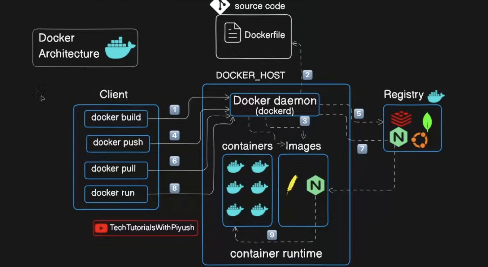
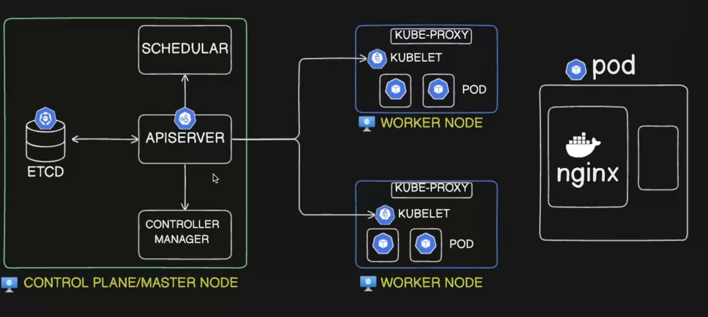

# Kubernetes Learning (Basics → Certified)

This repository is a hands-on Kubernetes learning workspace: short notes plus practical YAML manifests you can apply to a cluster while learning core concepts (pods, deployments, services, ingress, storage, autoscaling, security, scheduling, and more).

## Who this is for

- You’re learning Kubernetes and want small, focused examples.
- You want a personal “lab notebook” style repo you can revisit later.

## Prerequisites

- Basic Understanding of Docker as well
- A Kubernetes cluster: `kind`, `minikube`, Docker Desktop Kubernetes, or a real cluster
- `kubectl` configured to talk to that cluster
- Optional: `helm` (only if you try ingress controller setups that use Helm)

## Docker Architecture : 



## Kubernetes Architecture : 


## Clone this repo

```bash
git clone git@github.com:ARPITJAINECE/kubernetes_learning.git
cd kubernetes_learning
```

If you don’t have SSH set up for GitHub, use HTTPS:

```bash
git clone https://github.com/ARPITJAINECE/kubernetes_learning.git
cd kubernetes_learning
```

## How to use this repo

1. Pick a topic folder (for example `pods/` or `services/`).
2. Read the YAMLs and apply them to a non-production namespace.
3. Inspect resources with `kubectl get/describe/logs`, then delete what you created.

Learning workflow (create → observe → cleanup):

```bash
# 1) (recommended) create a sandbox namespace for all experiments
kubectl create namespace learning

# 2) Create objects from an example (pick a YAML file or a whole folder)
kubectl -n learning apply -f <path-to-yaml>
# or:
kubectl -n learning apply -f <path-to-folder>

# 3) Observe what you created
kubectl -n learning get all
kubectl -n learning describe <kind>/<name>
kubectl -n learning get events --sort-by=.metadata.creationTimestamp

# 4) Debug (common commands)
kubectl -n learning logs <pod-name> --all-containers --tail=200
kubectl -n learning exec -it <pod-name> -- sh

# 5) Cleanup (delete what you applied)
kubectl -n learning delete -f <path-to-yaml-or-folder>
```

Tips:

- Start small: apply one YAML at a time, verify it works, then move to the next.
- Keep one namespace per learning session (e.g. `learning`) so cleanup is easy.
- Prefer `kubectl apply` for iterating and `kubectl delete` to reset.

## Repository map (topics)

Most folders are named after the concept they demonstrate:

- Core building blocks: `basics/`, `pods/`, `replicas/`, `deployments/`
- Networking: `services/`, `networking/`, `ingress_controller/`, `ingress_full_steps_example/`, `tls/`
- Configuration: `config_maps/`, `secrets/`, `environment_variables/`
- Workloads: `jobs/`, `cron_jobs/`, `daemon_sets/`, `stateful_sets_and_headless_service/`, `multi_container_pods/`, `static_pods/`
- Scheduling: `node_selectors/`, `node_affinity/`, `taints_toleration/`, `priority_classes/`, `custom_schedulers/`
- Resources & policy: `resources_requirements/`, `limit_ranges/`, `resource_quotas/`, `Horizontal_pod_AutoScaling/`, `Vertical_Pod_AutoScaling/`
- Storage: `persistent_volumes/`, `storage_class/`
- Security & access: `service_accounts/`, `security/`, `adminssion_controllers/`, `user_acounts/`
- Rollouts: `rollouts_and_versioning/`
- Docker practice: `Docker_with_example/`, `Docker_practice_todo_app/`, `basic_docker_entrypoint_and_cmd_and_k8s/`

Note: some folder names contain typos but are kept as-is to avoid breaking paths.

## Notes / conventions

- Treat all manifests as learning examples; review and adapt before using anywhere serious.
- Prefer applying to a dedicated namespace (e.g. `learning`) and cleaning up afterwards.

## Contributing

If you find a mistake or want to add an example, feel free to open a PR.
